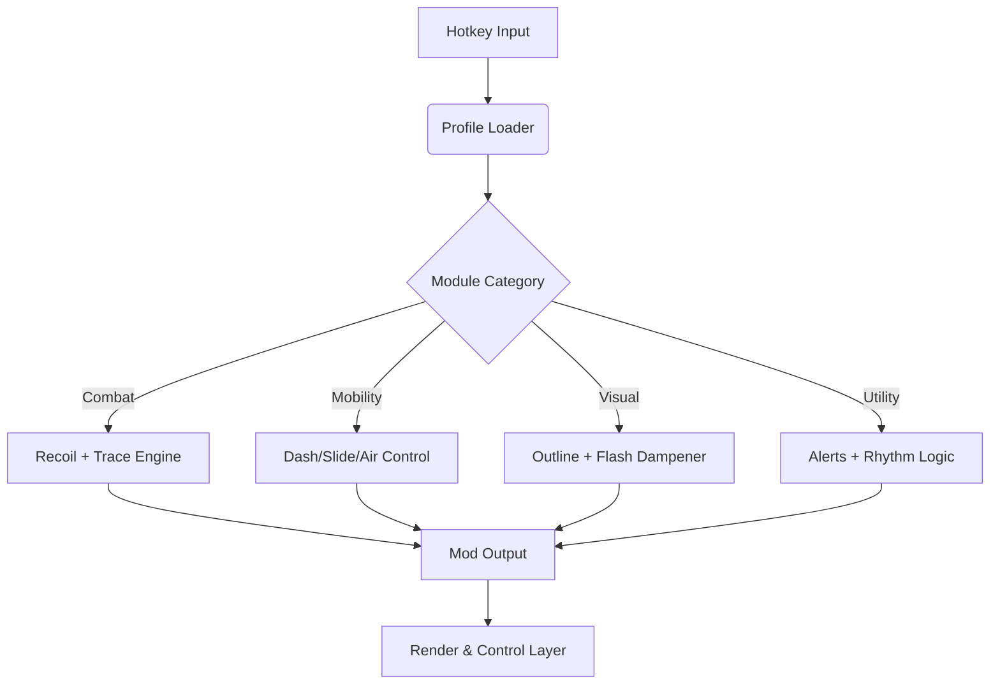

## 🎮 Overview

The REMATCH Mod Menu serves as a **real-time customization suite**, allowing you to adjust combat behavior, movement dynamics, battlefield visibility, and interface clarity on demand.

It’s not invasive.
It’s not overpowering.
It’s a companion that adapts to your pace—whether you brawl aggressively, weave defensively, or play the long spacing game.

---

## ⚔ Feature Set

### ⚡ Movement & Traversal

* **Dash Momentum Controller**
  Refines dash distance and acceleration for tighter spacing duels.
* **Air Drift Correction**
  Smooths mid-air strafing to maintain clean angles.
* **Slide Extension Logic**
  Lengthens ground slides without losing directional control.

### 🎯 Combat & Precision Tools

* **Recoil Pattern Manager**
  Tames bloom and vertical drift during sustained fire.
* **Target Trace Pulse**
  Micro-cues that help maintain alignment on evasive foes.
* **Hit Timing Glow**
  Slight highlight for perfect-confirm windows and punishes.

### 👁 Visual Awareness Modules

* **Enemy Silhouette Outlines**
  High-contrast borders for tracking opponents inside effect-heavy animations.
* **Objective Beacon Trails**
  Clears directional confusion in dynamic map modes.
* **Impact Flash Damping**
  Reduces visual overload during burst combos or ultimates.

### 💎 Utility & Resource Tools

* **Energy/Ammo Alerts**
  Subtle audio/visual cues before you run dry mid-combo.
* **Cooldown Rhythm Monitor**
  Keeps abilities and utility timings readable in peripheral vision.
* **Performance Stabilizer**
  Reduces frame dips during visual-heavy clashes.

### ⚙ System, Profiles & Tuning

* **Live Parameter Editor**
  Modify values mid-round without resetting anything.
* **Profile Manager**
  Switch instantly between Aggro / Neutral / Defensive / Mobility builds.
* **Overlay Optimization Layer**
  Built lightweight for fast-paced competitive matches.

---


---

## 🧩 Compatibility

| Platform                   | Support | Notes                      |
| -------------------------- | ------- | -------------------------- |
| Windows 10                 | ✔️      | Fully stable               |
| Windows 11                 | ✔️      | Best latency & clarity     |
| Steam Deck (Windows layer) | ⚠️      | Requires custom UI scaling |
| Linux/Proton               | ❌       | Injection unavailable      |

[!NOTE]
Includes colorblind modes, low-flash palettes, outline thickness scaling, and simplified silhouettes for players wanting cleaner feedback in high-speed duels.

---

## ⚡ Setup

1. Download the REMATCH Mod Menu archive
2. Extract to a dedicated tools folder
3. Run `REMATCH-ModMenu.exe` as Administrator
4. Launch **REMATCH**
5. Press **F7** to open the Mod Menu
6. Toggle modules and sculpt your playstyle

---

### Example Config: “Clarity Duelist”

```json
{
  "dashControl": 1.18,
  "airDrift": 0.40,
  "silhouetteOutlines": "neon-white",
  "targetTrace": 0.28,
  "hitGlow": 0.20
}
```

### INI Preset: “Aggro Chaser”

```ini
dash_extend=1
slide_boost=1
enemy_outline=1
target_trace=1
cooldown_monitor=1
overlay_refresh_ms=55
```

[!IMPORTANT]
Disable *Film Grain* and *Motion Blur* for razor-sharp silhouettes and combat readability.

---

## 🌀 Mermaid Diagram: Mod Menu Logic Pipeline



A lean, reactive system built for the pace of competitive action.

---

## 🔥 Feature Spotlight: Target Trace Pulse

In REMATCH, enemies pivot, dash-cancel, bounce off walls, weave dodge strings, and vanish into effect-heavy animations.
This module offers a frictionless touch of direction—
a whisper on the reticle that helps keep pursuit angles crisp without dragging control away from you.

Not aim-bot.
Not automation.
Just *clarity* in motion.

---

## 💬 FAQ

### Does the mod menu interact with matchmaking or server logic?

No. All changes are client-side visuals, assists, and handling adjustments.

### Do other players see my outlines or effects?

Never—everything renders only for your client.

### FPS impact?

2–4% for visual-heavy setups, <1% for mobility-only builds.

### Can I bind toggles to mouse buttons or controller?

Yes—all bindings are fully customizable.

### Can I use this without any assists?

Absolutely—run visual-only, movement-only, or minimalist HUD builds.

### Are profiles exportable?

Yes—JSON and INI formats supported.

---

## 🌙 Final Thoughts

REMATCH’s beauty lies in motion—
the elegant collapse and expansion of space between fighters,
the cadence of aggression and retreat,
the poetry of perfectly timed movement.

This **Mod Menu** is not there to win the match for you—
it’s there to let your mastery breathe.
To give you cleaner vision, smoother footing, and sharper instincts beneath the lightning-fast dance.

May your dashes land true,
your reads stay sharp,
and your rematches become legends.

---
